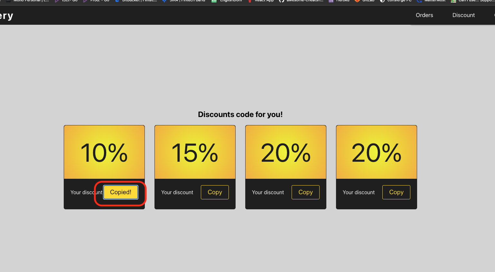
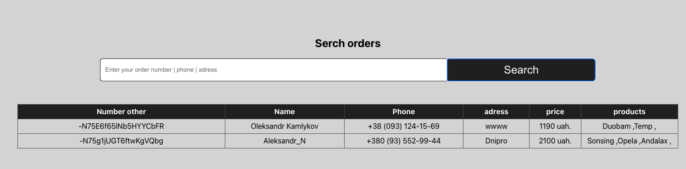
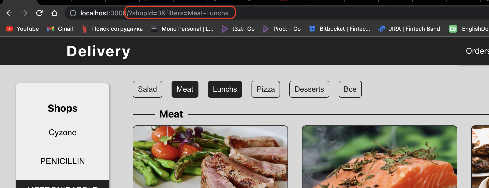

# Delivery-test
 [Demo](https://eiftech-front.herokuapp.com/)
 
 Front - React JS + TS
 [code](https://github.com/AleksandrKamlykov/delivery-front)
 Back - Express(node.js)
 [code](https://github.com/AleksandrKamlykov/delivery-back)
 
 Після відкриття сторінки завантажуєтся список магазинів та продуктів
 після завантаження потрібно спочутку вибрати магазин

 

 Після завантаження продуктів можна вибрати в фільтрах категорії страв та додати їх до кошику 

 

 Потім при переході на сторінку Дисконтних знижок можна вибрати знижку та скопіювати код по кліку

 

 Для оформлення замовлення потрібно заповнити всі данні
 Також можна вставити та перевірити дисконт, якщо успішно то сумма зменшиться: і поле підсвітится
 також Підключена reCaptcha v3 

 

 при переході на сторінку з замовленнями можливо знайти якесь конкретне або завантажити усі при пустому полі для вводу

 

Додатково реалізовано вибір магазину і филтрів з збереженням в url , наприклад для передачі знайомому, щоб не потрібно було шукати самому

 

 Також при перезавантаженні сторінки залишаються вибраними магазин, філтри та корзина
 при виборі товарів з конкретного магазина, інші магазини стають недоступні

 

